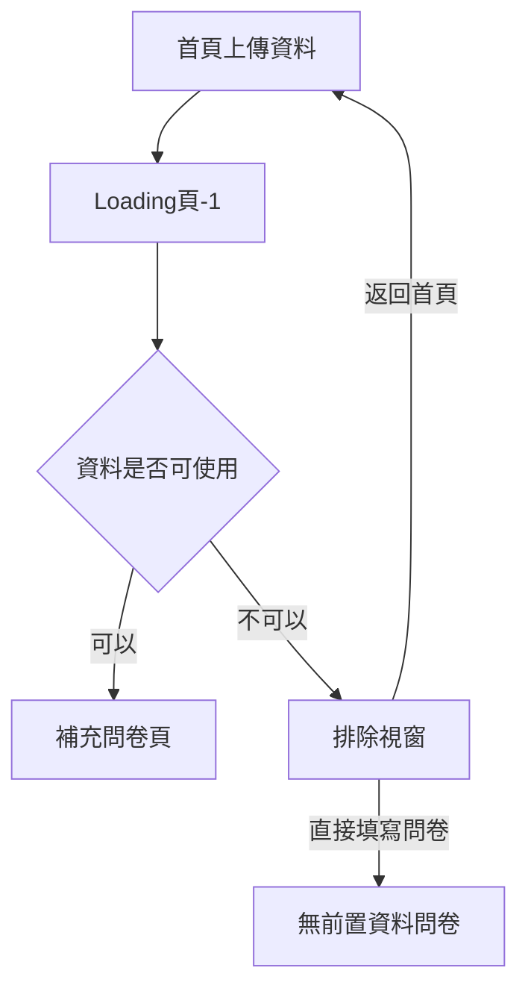

# Care U｜Loading頁-1 與排除視窗完成版頁面規格

## 1. 文件資訊

| 項目 | 內容 |
|---|---|
| 完成版原型 | `CareU_Loading頁-1_排除視窗_原型.html` |
| 規格狀態 | 已確認完成版 |
| 頁面範圍 | Loading頁-1、排除視窗、Loading → 問卷頁轉場示範 |
| 主要情境 | 上傳體檢資料後的讀取、分析與分流 |
| 原型形式 | 單一離線 HTML，CSS、JavaScript、字型與圖像資源皆內嵌 |
| 字型 | LINE Seed TW，內嵌 Regular 400、Bold 700 |
| 語系 | 繁體中文，`lang="zh-Hant"` |

本文件依完成版 HTML 的實際畫面與互動整理。入口頁、正式首頁、完整問卷內容、Loading頁-2 與報告頁不屬於本頁規格範圍。

## 2. 頁面目的

Loading頁-1 位於使用者從首頁上傳體檢資料之後，負責承接等待期間並讓使用者理解系統正在處理資料。正式系統預計由後端執行檔案判定、資料解析、健康資訊分析、缺漏資訊確認及補充問卷選擇；目前 HTML 僅模擬前端狀態與轉場，不執行 OCR、AI 分析、資料庫查詢、RAG 或動態問卷生成。

頁面同時預留兩種處理結果：

- 資料可使用：完成 Loading 後進入「已讀取體檢資料」來源的補充問卷。
- 資料不可使用：停止 Loading 流程並顯示排除視窗。

## 3. 流程關係

### 3.1 正常流程

1. 首頁完成檔案上傳。
2. 進入 Loading頁-1。
3. 依序顯示四個處理狀態。
4. Loading 畫面淡出。
5. 問卷頁淡入，顯示「系統已閱讀目前資料，只需補充缺少資訊」的來源說明。

### 3.2 排除流程

1. 首頁完成檔案上傳。
2. 進入 Loading頁-1。
3. 原型播放前兩個狀態後，模擬判定資料不可使用。
4. 在 Loading 背景上開啟排除視窗。
5. 使用者選擇返回首頁重新上傳，或直接進入無前置資料問卷。

## 4. 品牌與視覺基準

### 4.1 品牌色

| Token | 色彩 | 用途 |
|---|---|---|
| `--blue` | `#197AFC` | 品牌主色、Logo、主要按鈕、進度與互動狀態 |
| `--orange` | `#FB8F54` | Logo 圓點、背景互動強調色 |
| `--light-blue` | `#A3D3F7` | 背景資料點與柔和光暈 |
| `--coral` | `#EB938E` | 排除視窗叉號與警示圖示 |
| `--paper` | `#F7F8FA` | 頁面底色 |
| `--navy` | `#07295C` | 主要文字色 |
| `--muted` | `#687A93` | 說明文字與次要資訊 |
| `--white` | `#FFFFFF` | 卡片、視窗與按鈕反白文字 |

### 4.2 字型與字重

- 主字型：`CareU LINE Seed TW`。
- 後備字型：LINE Seed TW、Noto Sans TC、PingFang TC、Microsoft JhengHei、system-ui、sans-serif。
- 一般內文與選項：400。
- 狀態文字、標題、按鈕與標籤：700。
- 使用 `font-synthesis: none`，避免瀏覽器自行合成未提供的字重。
- 字型檔以 WOFF 格式內嵌，原型可離線顯示。

### 4.3 背景

背景延續 Care U 首頁互動頁的視覺語言：

- 白色至淺灰藍的垂直漸層。
- 左上淺藍、右下暖橘的柔和徑向光暈。
- 內嵌的後景節點圖層，降低飽和度、對比並加入模糊。
- Canvas 點陣資料場：桌機間距 34px，窄螢幕間距 30px。
- 精細指標裝置移動游標時，鄰近資料點會放大並由淺藍轉為品牌藍／暖橘，後景產生小幅視差。
- 不使用前景左右兩張節點圖。

## 5. Loading頁-1 畫面規格

### 5.1 版面

- 頁面最小高度：`100svh`。
- 主要內容置於畫面中央。
- 外層響應式留白：`clamp(24px, 5vw, 72px)`。
- Loading 內容最大寬度：680px。
- 畫面內文字禁止滑鼠拖曳反白；不影響頁面外的 Demo 控制與後續互動元件。

### 5.2 品牌 Logo

- 使用完成版 Care U 品牌 Logo，不變更造型、比例或顏色。
- 寬度：`clamp(119px, 16.2vw, 176px)`，參考入口頁的 Logo 視覺尺寸。
- 品牌藍主體搭配暖橘圓點。
- 整體帶有柔和藍色陰影，不使用傳統 Spinner。
- 暖橘圓點執行上下跳動動畫，週期 1.45 秒。

### 5.3 狀態對話框

- 參考首頁「［你的身體］正在輸入訊息……」樣式。
- 白色半透明底、細藍色邊框、18px 圓角與柔和陰影。
- 使用 `backdrop-filter: blur(12px)`。
- 內距：上 15px、左右 25px、下 16px。
- 文字字重：700。
- 對話框左下保留小型對話尾巴。
- 狀態切換時，文字以 0.23 秒淡出、向下 5px 位移，再淡入新文字。
- 只有文字內容切換，整個對話框不閃爍。

### 5.4 動態省略號

- 每個狀態後固定三個點。
- 三點依序進行小幅上跳與透明度變化。
- 單次動畫週期 1.2 秒，第二、第三點分別延遲 100ms、200ms。
- 動畫持續循環，不使用旋轉式 Loading 圖示。

### 5.5 底部提示

文案：

> 請保持頁面開啟，我們正在整理你提供的資料。

- 固定於 Loading 畫面的視窗底部中央。
- 距離底部：`24px + env(safe-area-inset-bottom)`。
- 寬度：畫面寬度減 40px。
- 字級：0.88rem。
- 使用低對比深藍色，避免搶過主要狀態訊息。

## 6. Loading 狀態與示範時間

| 順序 | 狀態文案 | 原型停留時間 | 功能意義 |
|---|---|---:|---|
| 1 | 讀取檔案中…… | 1.8 秒 | 取得上傳檔案並確認可讀取性 |
| 2 | 正在分析資料…… | 2.4 秒 | 模擬解析內容與健康資料分析 |
| 3 | 正在整理需補充資訊…… | 2.2 秒 | 模擬判斷推薦流程仍缺少的資料 |
| 4 | 正在準備下一步…… | 1.1 秒 | 準備進入補充問卷 |

- 正常流程示範總時間約 7.5 秒，完成後進入問卷頁。
- 排除流程播放前兩段，約 4.2 秒後開啟排除視窗。
- 上述時間僅供互動原型展示，不代表真實分析進度。
- 正式網站應由後端事件驅動狀態切換；不可用固定秒數假裝真實處理百分比。
- 若後端處理時間較長，可停留於符合當下處理內容的狀態，省略號動畫持續循環。

## 7. 成功轉場

- Loading 與問卷頁使用同一組全畫面 Screen 容器。
- 離場畫面淡出並向下位移 8px；進場畫面淡入回到原位。
- 轉場時間：0.55 秒。
- 不加入旋轉、縮放或複雜頁面變形。
- 進入問卷後自動回到頁面頂端。

## 8. 排除視窗規格

### 8.1 觸發條件

正式系統可在下列情況開啟排除視窗：

- 檔案內容不是體檢或健康相關資料。
- 檔案內容無法辨識。
- 檔案格式或內容完全不符合目前系統可處理範圍。

原型不實際判讀檔案，只由 Demo 排除流程模擬觸發。

### 8.2 視窗層級與尺寸

- 視窗位於全畫面半透明深藍遮罩上。
- 遮罩使用 9px 背景模糊，避免與底層 Loading 畫面混淆。
- Modal 最大寬度：600px。
- 內距：`clamp(28px, 5vw, 46px)`。
- 桌機圓角：32px；手機圓角：26px。
- 開啟時由下方 10px、小幅縮小狀態淡入至正常位置，動畫 0.35 秒。

### 8.3 圖示

- 使用珊瑚粉叉號圖示，不使用節點圖騰。
- 外層圖示容器 64 × 64px、20px 圓角、淡珊瑚粉底。
- 圖示置中，與錯誤訊息保持溫和距離，不使用強烈紅色警示。

### 8.4 文案

標題：

> 目前無法使用這份資料

說明：

> 這份檔案可能不是體檢或健康相關資料，或內容暫時無法辨識。你可以返回首頁重新上傳其他檔案，或直接填寫健康問卷。

- 標題置中。
- 說明文字維持左對齊，以利較長句閱讀。
- 語氣說明目前資料無法使用，不將原因歸咎於使用者操作錯誤。

### 8.5 按鈕

| 層級 | 按鈕 | 補充文字 | 行為 |
|---|---|---|---|
| 主要 | 返回首頁 | 重新上傳檔案 | 關閉 Modal 並顯示原型首頁狀態 |
| 次要 | 直接填寫問卷 | 無 | 關閉 Modal 並進入無前置資料的問卷來源 |

- 桌機版雙欄並排，欄距 14px。
- 手機版改為單欄直排，按鈕滿寬。
- 「返回首頁」使用品牌藍實心按鈕，維持首頁為主要出口。
- 「直接填寫問卷」使用淺灰藍次要按鈕。

## 9. 返回首頁流程

原型內的首頁畫面僅用於驗證排除流程返回後的選擇，不代表重新設計正式首頁。畫面提供：

- 「從體檢資料開始瞭解」：開啟原型檔案選擇器，可選 PDF、JPG、JPEG、PNG，支援多檔；選擇後重新播放正常 Loading 流程。
- 「沒有資料？先從問卷開始 →」：直接進入無前置資料問卷來源。

正式整合時，返回首頁應交由網站路由處理，並沿用已完成的正式首頁。

## 10. 問卷頁銜接展示範圍

### 10.1 經資料分析後進入

- 來源標籤：資料補充。
- 標題：我們已讀取你提供的體檢資料。
- 說明：接下來只需要補充幾項資訊，幫助我們更完整地了解你的日常狀況。

### 10.2 原型示範題目

原型僅提供三題，用於確認 Loading → 問卷的版型與轉場：

1. 近一個月主觀睡眠品質如何？
2. 每週中高強度活動總時數？
3. 一等親是否有高血脂或心血管病史？

題目為單選，未選答案前「下一題」維持停用；最後一題按鈕改為「完成示範」。完整問卷內容以獨立的問卷頁完成版為準，不以此檔案中的三題作為正式資料結構。

### 10.3 無資料直接進入

此來源僅供排除視窗次要按鈕與原型首頁測試：

- 來源標籤：健康問卷。
- 標題：先從幾個日常問題開始。
- 說明：沒有體檢資料也沒關係，我們會從你的生活習慣與健康狀況開始了解。

## 11. Demo 控制面板

- 固定於桌機右下 20px；手機右下 12px。
- 預設收合，只顯示「Demo」膠囊按鈕。
- 展開後提供三個操作：播放正常流程、播放排除流程、重新開始。
- 「重新開始」會重播目前選定的正常或排除情境。
- 面板只供展示與測試，不屬於正式網站介面；正式整合時應移除或僅在開發環境啟用。

## 12. Desktop 與 Mobile 響應式規格

主要斷點為 650px。

| 項目 | Desktop | Mobile（≤650px） |
|---|---|---|
| Screen 留白 | `clamp(24px, 5vw, 72px)` | 上下 84px／88px，左右 18px |
| Loading 對話框字級 | `clamp(.83rem, 1.5vw, .96rem)` | 0.8rem |
| 後景節點 | inset -5%、opacity .22 | inset -8%、opacity .18 |
| 問卷選項 | 兩欄 | 單欄 |
| 問卷卡片 | 最大 900px、34px 圓角 | 左右 18px 內距、25px 圓角 |
| 排除視窗按鈕 | 雙欄 | 單欄滿寬 |
| 排除視窗圓角 | 32px | 26px |
| Demo 控制 | 右下 20px | 右下 12px |

底部 Loading 提示使用 `safe-area-inset-bottom`，避免被有 Home Indicator 的手機遮擋。

## 13. Accessibility

- 文件語系設定為繁體中文。
- Loading 主狀態使用 `aria-live="polite"` 與 `aria-atomic="true"`，狀態更新不強制打斷使用者。
- 動態省略號設為 `aria-hidden="true"`，避免輔助技術重複朗讀三個點。
- Logo 具有「Care U 正在整理資料」可存取名稱。
- 排除視窗使用 `role="dialog"`、`aria-modal="true"`，並由標題與說明文字建立關聯。
- Modal 開啟後移動焦點至視窗，Tab／Shift+Tab 被限制在兩個操作按鈕之間。
- 所有按鈕與輸入元件提供 3px 品牌藍可見焦點框。
- 問卷選項使用原生 radio input 與 radiogroup 語意。
- 裝飾背景、光暈與圖像使用 `aria-hidden` 或空白替代文字。
- Loading 畫面文字不可拖曳反白，但不影響螢幕閱讀器朗讀。

## 14. Reduced Motion

偵測 `prefers-reduced-motion: reduce` 後：

- CSS 動畫時間縮短至近乎靜止，動畫只執行一次。
- 一般轉場縮短為 0.15 秒。
- Logo 暖橘圓點停止跳動。
- 三點改為靜態低透明度顯示。
- Canvas 資料點停止呼吸脈動。
- JavaScript 示範計時單段最多縮短為 500ms，避免等待過久。
- 頁面捲動改為立即定位，不使用平滑捲動。

## 15. 原型技術與正式整合界線

### 15.1 原型目前負責

- 全畫面 Loading 視覺與四段狀態文案。
- Logo、動態三點、背景互動與柔和轉場。
- 成功／排除兩條模擬流程。
- 排除視窗、返回首頁與直接問卷按鈕。
- 問卷頁轉場與少量題目展示。
- Demo 控制面板。

### 15.2 正式網站應由後端或整合層負責

- 檔案安全檢查與格式驗證。
- OCR／文件解析與健康欄位辨識。
- 資料庫、知識庫或 RAG 查詢。
- 健康資訊分析與缺漏資料判斷。
- 補充問卷選擇或生成。
- 真實成功、排除、逾時與系統錯誤事件。
- 上傳檔案生命週期、去識別化與刪除政策。

正式整合時，應以後端回傳的狀態更新 Loading 文案，並由真實結果決定進入補充問卷或開啟排除視窗；原型內的 `setTimeout` 只用於展示。

## 16. 後續可擴充但未納入完成版的狀態

下列狀態未在本次原型中另做畫面，正式開發時需另外確認：

- 網路中斷或請求逾時。
- 系統暫時忙碌，可重試但不屬於檔案排除。
- 部分檔案可用、部分檔案不可用。
- 使用者主動取消分析或離開頁面。
- 檔案受密碼保護、損毀或超過容量限制。
- 後端已完成，但問卷載入失敗。

這些狀態不可全部沿用「目前無法使用這份資料」，以免把系統錯誤誤判為使用者資料問題。

## 17. 完成版驗收基準

- HTML 可單檔開啟，不依賴外部字型或圖像網址。
- LINE Seed TW 400／700 正常套用，中文字不使用瀏覽器合成字重。
- 正常流程依序播放四個狀態並進入資料補充問卷。
- 排除流程播放至分析階段後顯示排除視窗。
- 「返回首頁」與「直接填寫問卷」均可抵達正確原型狀態。
- Loading 底部提示在桌機與手機安全區內可見。
- Loading頁-1 文字不可拖曳反白。
- 排除視窗標題置中，叉號圖示與雙按鈕層級正確。
- 手機版無水平溢出，排除按鈕改為單欄。
- Reduced Motion、鍵盤焦點及 Modal 焦點循環正常。
- Demo 控制面板可重播正常與排除流程。

---

本規格以 `CareU_Loading頁-1_排除視窗_原型.html` 為完成版依據。後續修改應同步更新原型與本規格文件，避免畫面、文案及互動定義不一致。
