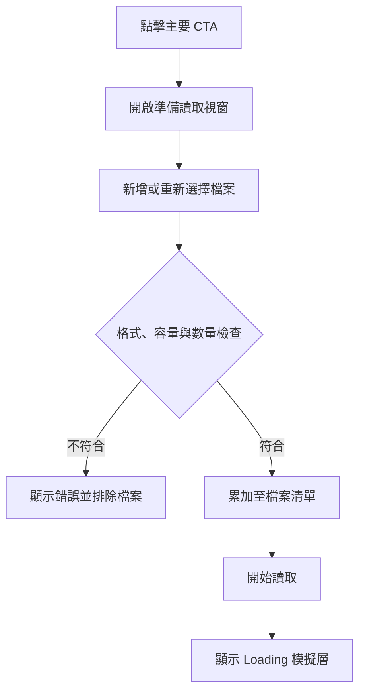

# CareU 首頁原型｜頁面規格總結

## 1. 文件資訊

| 項目 | 規格 |
| --- | --- |
| 對應原型檔名 | `CareU_首頁原型.html` |
| 頁面名稱 | Care U 首頁 |
| 文件狀態 | 首頁原型完成版規格 |
| 最後整理日期 | 2026-09-23 |
| 頁面語系 | 繁體中文（`zh-Hant`） |
| 主要目的 | 建立 Care U 服務入口，將使用者分流至「上傳體檢資料」或「健康問卷」流程，並於第二屏說明資料用途、判讀依據與使用界線。 |

> 本文件依完成版首頁原型整理。規格中的「已實作」是指前端原型行為；登入、問卷、資料上傳與 Loading 頁仍為模擬入口，尚未串接正式服務。

---

## 2. 頁面資訊架構

首頁由兩個垂直排列的滿版區段，以及三組全域浮層構成。

| 區域 | 內容 | 主要功能 |
| --- | --- | --- |
| 第一屏 Hero | 品牌動畫、核心文案、上傳 CTA、問卷入口、節點視覺 | 建立品牌印象並完成主要流程分流 |
| 第二屏說明頁 | 資料使用、判讀依據、使用界線、頁尾連結 | 建立信任並說明服務範圍 |
| 上傳視窗 | 檔案格式提示、檔案清單、錯誤訊息、操作按鈕 | 選擇與管理待讀取檔案 |
| Loading 模擬層 | Spinner、流程提示、返回按鈕 | 模擬進入資料辨識頁 |
| 會員入口 | Care U U 形圖示與 `Login` 文字 | 提供全頁固定會員登入入口 |

頁面採垂直 Scroll Snap：第一屏與第二屏皆對齊視窗起點，桌面滑鼠滾輪會協助整屏切換。

---

## 3. 品牌與視覺規格

### 3.1 字型

- 主要字型：`LINE Seed TW`，以 WOFF 內嵌於單一 HTML。
- 後備字型：`Noto Sans TC`、`PingFang TC`、`Microsoft JhengHei`、系統無襯線字型。
- 整體採繁體中文無襯線風格，標題使用高字重，輔助文字降低透明度建立階層。

### 3.2 色彩

| Token | 色值 | 使用情境 |
| --- | --- | --- |
| Primary Blue | `#197AFC` | 主要 CTA、連結、圖示、焦點色 |
| Orange | `#FB8F54` | 節點互動強調、輔助色 |
| Sky Blue | `#A3D3F7` | 背景光暈、節點、資訊編號底色 |
| Coral | `#EB938E` | 輔助光暈、錯誤提示、第三資訊卡 |
| Surface | `#F7F8FA` | 頁面底色、次要按鈕與元件底色 |
| Navy | `#07295C` | 主標題、正文、頁尾底色 |
| White | `#FFFFFF` | 卡片、Modal、文字反白 |

### 3.3 共同造型

- 主要按鈕與功能按鈕使用膠囊圓角。
- 卡片與 Modal 採大圓角、低對比邊框與柔和陰影。
- 半透明元件使用 `backdrop-filter: blur(...)` 製造玻璃質感。
- 主視覺保留大量留白，文字與操作集中於畫面中央。

---

## 4. 第一屏 Hero 規格

### 4.1 版面

- 最小高度：`100svh`。
- 內容容器最大寬度：`850px`；水平置中。
- 主內容以 Flex 垂直置中，桌面上方留白使用 `clamp(138px, 19vh, 190px)`。
- 背景由白色至淺灰藍漸層，另疊加天空藍與橘色柔光。
- 底部中央提供向下箭頭，點擊後前往第二屏說明頁。

### 4.2 品牌標準字動畫

1. 頁面載入時，Care U 圖示位於畫面中央附近。
2. 品牌圖示向上移至頁面頂部中央。
3. 圖示縮小後，右側標準字展開並滑入。
4. 動畫完成後形成首頁上方中央品牌鎖定組合。

主要參數：

| 項目 | 桌面規格 | 手機規格 |
| --- | --- | --- |
| 初始品牌圖示寬度 | `68px` | `61px` |
| 完成後品牌圖示寬度 | `46px` | `46px` |
| 標準字顯示寬度 | 約 `142–148px` | 約 `118–124px` |
| 完成位置 | `top: clamp(34px, 6.2vh, 66px)` | `top: 27px` |

SVG ViewBox 已額外保留邊界，避免品牌圖示與標準字邊緣被裁切。

### 4.3 文案與操作

| 層級 | 內容 |
| --- | --- |
| 輸入狀態 | `［你的身體］正在輸入訊息……` |
| 主標題 | `如果身體會說話，最近想跟你說什麼？` |
| 主要 CTA | `從體檢資料開始瞭解` |
| 隱私提示 | `檔案將轉為去識別化資料保留 30 天，到期自動刪除。` |
| 次要入口 | `沒有資料？先從問卷開始 →` |

主要 CTA 規格：

- 桌面最小寬度 `250px`，內距 `15px 28px`。
- 手機最小寬度 `232px`，內距 `13px 22px`。
- 藍底白字、全圓角，具有陰影。
- Hover 時背景略深、陰影加強，並有光澤橫向滑過。
- 點擊 CTA 後直接開啟「準備讀取資料」視窗，不先觸發檔案選擇器。

### 4.4 三層節點圖像

三張節點圖像皆為裝飾層，設定 `aria-hidden="true"` 且不攔截指標事件。

| 圖層 | 位置與尺寸 | 視覺處理 | 游標位移 |
| --- | --- | --- | --- |
| 背景節點網絡 | 超出四邊約 `5%`、鋪滿畫面、`scale(1.08)` | 透明度 `.22`、低飽和、低對比、`blur(6px)` | 與游標反向，最大約 X `7px`、Y `5px` |
| 左下前景節點 | 左側與底部超出版面；寬度 `min(64vw, 940px)` | 透明度 `.78`、位於文字上方 | 與游標反向，最大約 X `34px`、Y `23px` |
| 右上前景節點 | 右側與頂部超出版面；寬度 `min(50vw, 760px)` | 透明度 `.78`、位於文字上方 | 與游標同向，最大約 X `28px`、Y `19px` |

前景兩張圖層使用較高層級，可覆蓋標題與操作文字；三層的位移方向與幅度不同，形成景深。游標離開 Hero 後，圖層以約 `700ms` 緩動回到原位。

### 4.5 Canvas 互動點陣

- Hero 底層另有 Canvas 點陣，桌面點距約 `34px`，窄畫面約 `30px`。
- 中央內容區的點陣透明度降低，避免影響主標題辨識。
- 游標進入半徑 `125px` 內時，點會放大並由淺藍轉為主藍或橘色。
- 高 DPI 畫面最多以 `2x devicePixelRatio` 繪製。
- 僅在細緻指標裝置啟用游標追蹤；觸控裝置不執行視差追蹤。

---

## 5. 上傳視窗規格

### 5.1 開啟與關閉

- 點擊主要 CTA，立即開啟 Modal。
- 視窗標題：`準備讀取資料`。
- 說明：`確認檔案後再按「開始讀取」，目前尚未上傳。`
- 支援格式提示放在 Modal 內：`支援 PDF、JPG、PNG，可選擇多個檔案。`
- 關閉方式：右上角關閉按鈕、點擊遮罩空白處、鍵盤 `Esc`。
- Modal 開啟時以深藍半透明遮罩及背景模糊隔離頁面內容。

### 5.2 檔案選擇與累加

- 點擊 `新增或重新選擇` 才開啟系統檔案選擇器。
- 允許選擇 `PDF`、`JPG/JPEG`、`PNG`。
- `multiple` 開啟，可一次選擇多檔。
- 後續再次選擇檔案時採「新增」方式累加，不會清除第一次選擇的檔案。
- 重複檔案以 `檔名 + 容量 + lastModified` 判定並排除。
- 每次選擇完成後清空原生 input 值，允許日後再次選取同一檔案。

### 5.3 限制與錯誤

| 規則 | 限制 | 錯誤回饋 |
| --- | --- | --- |
| 檔案格式 | PDF、JPG/JPEG、PNG | Modal 內錯誤泡泡與右下 Toast |
| 單檔容量 | 最大 `25MB` | `單一檔案請勿超過 25MB。` |
| 檔案數量 | 最多保留 `10` 個 | `一次最多保留 10 個檔案。` |
| 未選檔案 | 不得開始讀取 | `開始讀取` 維持 Disabled |

錯誤檔案不加入清單；同批次中符合規格的檔案仍可加入。若格式錯誤與容量超限同時發生，畫面顯示最後一次寫入的容量錯誤訊息。

### 5.4 檔案清單

每個檔案項目顯示：

- 副檔名標籤。
- 完整檔名；過長時以省略號顯示。
- 檔案容量（KB 或 MB）。
- 單檔移除按鈕。

移除所有檔案後，`開始讀取` 按鈕再次停用。

### 5.5 開始讀取

- 有至少一個有效檔案時按鈕才可操作。
- 點擊後關閉上傳視窗，開啟 Loading 模擬層。
- 原型不會實際上傳或解析健康資料。
- Modal 底部需保留原型聲明：正式版本應提供完整資料保存與刪除規則。

流程如下：

---

## 6. Loading 模擬層

| 項目 | 內容 |
| --- | --- |
| 標題 | `正在前往資料辨識頁` |
| 說明 | `首頁流程模擬至此，下一步將進入 Loading 頁。` |
| 視覺 | 藍色旋轉 Loading Spinner |
| 操作 | `返回首頁原型` 關閉模擬層 |

正式版應將此操作改為導向已定義的資料辨識 Loading 頁，不保留原型返回按鈕。

---

## 7. 問卷入口

- 入口文案：`沒有資料？先從問卷開始 →`。
- 視覺為深藍文字與底線；Hover 時切換為主藍。
- 目前點擊後以 Toast 顯示 `原型提示：此處將前往健康問卷頁`。
- 正式版需串接健康問卷頁路由。

---

## 8. 第二屏說明頁

### 8.1 標題

- Kicker：`放心探索`。
- 主標題：`讓資料的來源、用途與界線，都清楚可見。`

### 8.2 三張資訊卡

| 編號 | 標題 | 內容重點 | 連結 |
| --- | --- | --- | --- |
| 01 | 資料如何使用 | 原始檔案於解析並轉為結構化資料後永久刪除；去識別化數值與評估紀錄保留 30 天 | 查看隱私說明 |
| 02 | 判讀依據 | 依循衛福部公告的 14 項健康食品保健功效評估架構；推薦以審查通過的健康食品為基礎 | 查看資料來源 |
| 03 | 使用界線 | 結果僅供健康管理參考，不取代醫師診斷、治療或專業醫療建議 | 查看使用說明 |

桌面版為三欄卡片；`820px` 以下改為單欄排列。原型中的卡片連結皆顯示提示 Toast，正式版需連至對應說明內容。

### 8.3 頁尾

- 版權文字：`© Care U Prototype · Typeface: LINE Seed TW`。
- 連結：隱私權政策、資料來源、使用條款、健康資訊聲明。
- 桌面為左右排列；`820px` 以下改為垂直排列。
- 原型連結皆為提示用途，尚未串接正式頁面。

---

## 9. 會員登入入口

- 使用 Care U U 形 SVG 圖示，不含白色底板。
- 圖示下方顯示 `Login`，文字使用主色藍 `#197AFC`。
- 元件固定於視窗，不隨一般內容流消失。
- 第一屏位置：右下角。
- 捲動超過半個視窗高度後：移至右側垂直中央。
- 桌面容器寬 `72px`、圖示寬 `48px`。
- `520px` 以下容器寬 `64px`、圖示寬 `42px`，右側 `12px`、底部 `14px`。
- Hover 時略微上移、放大並增加陰影。
- 目前點擊後顯示 `原型提示：此處將開啟會員登入`；正式版需串接登入流程。

---

## 10. 捲動與指標互動

### 10.1 整屏導覽

- HTML 使用 `scroll-snap-type: y mandatory`。
- Hero 與說明頁皆使用 `scroll-snap-align: start`、`scroll-snap-stop: always`。
- 桌面細緻指標裝置上，滾輪位移絕對值達 `8` 以上時觸發整屏切換。
- 動畫期間約鎖定 `780ms`，避免連續觸發。
- Modal 或 Loading 模擬層開啟時，不攔截滾輪進行換頁。
- 觸控裝置保留原生捲動與 Scroll Snap 行為。

### 10.2 Toast

- 固定於右下角，白色半透明背景、圓角與陰影。
- 顯示時間約 `2.8s`。
- 錯誤狀態改用珊瑚色邊框與深紅文字。
- 使用 `role="status"` 與 `aria-live="polite"` 提供輔助技術提示。

---

## 11. 響應式規格

### 11.1 斷點

| 斷點 | 行為 |
| --- | --- |
| `821px` 以上 | 第二屏固定為單一視窗高度；三欄資訊卡；頁尾固定於第二屏底部區域 |
| `820px` 以下 | 資訊卡改為單欄；頁尾改為垂直排列；內容高度可自然延伸 |
| `520px` 以下 | 品牌、標題、CTA、節點圖層、Modal、會員入口全面縮放與重新定位 |

### 11.2 手機版重點

- Hero 左右留白縮為 `14px`。
- 主標題使用 `clamp(2rem, 10.5vw, 3rem)`。
- 上傳視窗內距縮小，圓角改為 `24px`。
- Modal 雙按鈕改為上下排列，`開始讀取` 位於視覺上方。
- 左下前景節點放大至 `105vw`，右上前景節點約 `88vw`，並降低透明度避免遮擋過重。
- 使用 `svh` 與 Safe Area 環境變數，兼容行動瀏覽器工具列與瀏海區域。

---

## 12. 動效與無障礙

### 12.1 動效

- 品牌入場、輸入狀態、主文案、按鈕光澤、節點視差、點陣回應、向下箭頭與 Loading Spinner 皆有動效。
- 主要緩動曲線：`cubic-bezier(.22,.76,.22,1)`。
- 品牌主文案約在頁面載入 `2.75s` 後完成淡入。

### 12.2 Reduced Motion

當使用者系統偏好 `prefers-reduced-motion: reduce` 時：

- 關閉平滑捲動。
- 動畫與轉場縮短至近乎即時。
- 品牌直接顯示在完成位置。
- 標準字、主文案與輸入狀態直接顯示。
- 停止節點過場與 Canvas 呼吸動畫。
- 整屏切換改為即時。

### 12.3 鍵盤與語意

- 按鈕與連結保留 `:focus-visible` 外框。
- Modal 使用 `role="dialog"`、`aria-modal="true"` 與標題關聯。
- 錯誤訊息使用 `role="alert"`。
- 裝飾圖像與 Canvas 使用 `aria-hidden="true"`。
- 品牌與主要區段具有語意標題關聯。
- `Esc` 可關閉上傳與 Loading 浮層。

目前原型尚未實作完整 Focus Trap、開啟 Modal 後的焦點移入，以及關閉後焦點返回；正式版需補齊。

---

## 13. 技術與資產規格

- 單一 HTML 檔案，CSS 與 JavaScript 皆內嵌。
- LINE Seed TW、三張節點圖像與品牌視覺資產皆以 Data URL 或 Inline SVG 內嵌，可離線展示。
- 不依賴外部 JavaScript 框架或 CDN。
- Canvas 尺寸會在視窗 resize 時重建。
- 檔案選擇僅保存在瀏覽器記憶體中的 `selectedFiles` 陣列，重新整理後清除。
- 原型未實作拖放上傳、實際 API、資料解析、登入驗證、問卷路由與正式內容頁。

---

## 14. 正式版待串接項目

1. 將 `開始讀取` 串接至正式上傳 API 與資料辨識 Loading 頁。
2. 實作上傳進度、網路錯誤、伺服器錯誤、重試與取消機制。
3. 依正式政策同步上傳視窗與第二屏的資料保存、刪除及同意文案。
4. 將問卷入口串接至健康問卷頁。
5. 將會員入口串接至登入／註冊流程。
6. 補齊隱私權政策、資料來源、使用條款與健康資訊聲明頁。
7. 實作 Modal Focus Trap、焦點還原與背景捲動鎖定。
8. 視需要加入 GA／事件追蹤，但不得記錄健康檔案內容或敏感資料。

---

## 15. 驗收清單

- [ ] 首頁載入後品牌動畫完整，Logo 與標準字邊緣沒有裁切。
- [ ] Hero 文案、CTA、隱私提示與問卷入口內容正確。
- [ ] 背景節點模糊，兩張前景節點位於文字上層。
- [ ] 三張節點圖像的游標位移方向與幅度皆不同。
- [ ] 點擊 CTA 先開啟上傳視窗，不直接開啟檔案選擇器。
- [ ] 支援格式提示只出現在上傳視窗內。
- [ ] 多次選檔採累加方式，既有檔案不被覆蓋。
- [ ] 重複檔案、格式、25MB 與 10 檔上限判斷正確。
- [ ] 檔案可單筆移除；無檔案時不可開始讀取。
- [ ] 點擊開始讀取後進入 Loading 模擬／正式流程。
- [ ] Login 圖示無白底，文字為主色藍，圖像沒有裁切。
- [ ] 第一屏時 Login 位於右下，進入說明頁後位於右側中央。
- [ ] 桌面可整屏切換；手機可自然捲動並正確排列。
- [ ] Reduced Motion、鍵盤焦點、Esc 關閉與 ARIA 提示正常。

